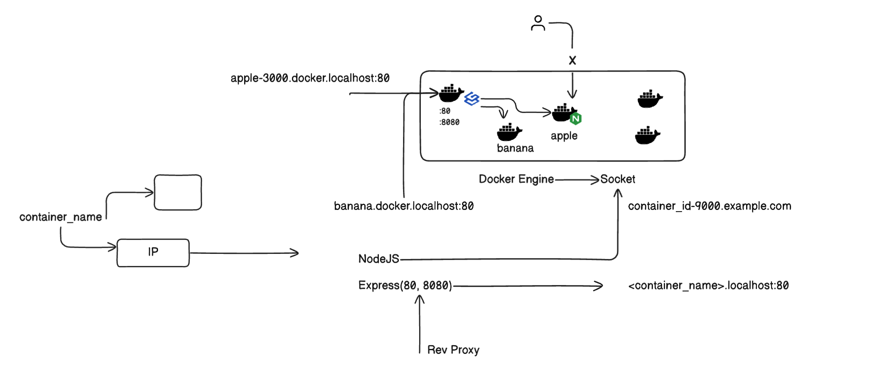

# Reverse Proxy for Docker Containers

This is a minimal reverse proxy and container management system built with Node.js, Docker API, and Express. Inspired by [Traefik](https://traefik.io), it dynamically routes HTTP requests to running containers based on subdomains like `banana.localhost`.

---

## Features

- Auto container discovery via Docker socket
- Subdomain routing (`banana.localhost → 172.x.x.x:PORT`)
- Supports WebSocket upgrades
- Simple REST API to launch containers

---

## Project Structure

```
.
├── Dockerfile.dev          # Node.js development container
├── docker-compose.yml      # Compose file with volume mount to Docker socket
├── index.js                # Reverse proxy and API logic
```

---

## How It Works

### System Architecture



⬆️ The proxy listens on port `80` and forwards traffic to containers that are started and registered. Each container is exposed at a subdomain of `.localhost`.

---

## Launch a Container via API

Use the management API to pull and run any image. For example:

```bash
curl -X POST http://localhost:8080/containers \
     -H "Content-Type: application/json" \
     -d '{"image": "api"}'
```

You'll get a response like:

```json
{
  "status": "success",
  "container": "/epic_hofstadter.localhost"
}
```

---

## Access the Service

Once the container is running and registered, access it using:

```
http://epic_hofstadter.localhost
```

Sample output:

```json
{
  "status": "Success",
  "message": "Hello from express server"
}
```

---

## Prerequisites

- Docker
- Docker Compose
- `/etc/hosts` or DNS support for `*.localhost`

---

## Run the Proxy

```bash
docker-compose up --build
```

---

## Limitations

- Only supports containers exposing a TCP port
- Routing info is stored in memory (non-persistent)
- No TLS or HTTPS support (for now)
- Only works in environments where `.localhost` is resolvable

---

## TODOs

- Add TLS support (Let's Encrypt or manual)
- Persist routing table (e.g., Redis or SQLite)
- Build a UI dashboard
- Support multiple ports and networks
